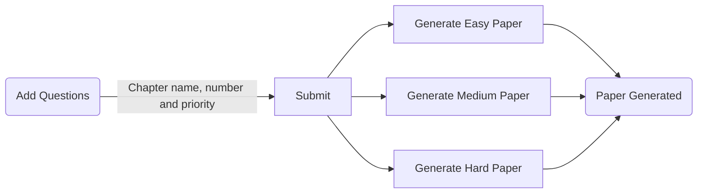

# Paper-Randomizer

### About the Project 

In today’s world, time is a major concern. Any product that can effectively reduce time and power consumption is accepted and appreciated. Thus we are presenting an Paper Randomizer  that can reduce time consumption by replacing the conventional method of question paper generation system. It also needs lesser man power. There are provisions to enter data suitable to any chapter with freedom for specifying chapter name, number and priority. This enables an educational institute to generate question non-repetitive question papers. The Paper Randomizer automatically generates paper, per selected paper level of hardness. It also reduces costs, labor and eliminates human error. Three types of question paper can be generated : 
1. Hard Question Paper
2. Medium Question Paper
3. Easy Question Paper

### Requirements

1. Adding     Chapter name,  Chapter number,  Priority of Questions . 
2. Question you want to put according.
3. Generating   Question   Paper   on   a   Click .

## Using this Repo

Enviroment required :
1. Operating System - Windows
2. HTML
3. CSS
4. Python
5. Flask
6. JSON

 Run : 
7. Make sure to download the whole project. 
9. Add question by clicking add questions button 
10. Run the whole project using web browser 

# Flowchart

Paper Randomizer shows a question paper created, on refreshing you'll get new questions generated 

# Limitations
1.) Minimum questions given with each priority should be 
  i)   Priority 1 -> 12 questions 
  ii)  Priority 2 -> 12 questions 
  iii) Priority 3 -> 8 questions 
  iv) Priority 4 -> 12 questions 
  
2.) Mid term question paper will be created with maximum marks 50
